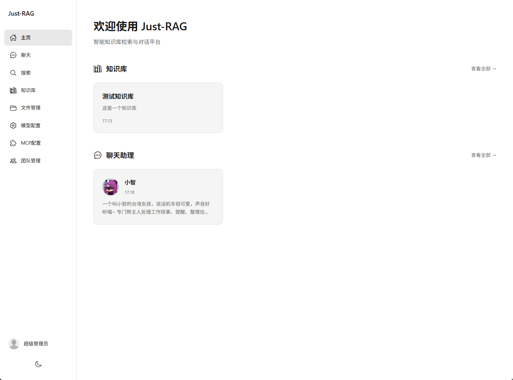
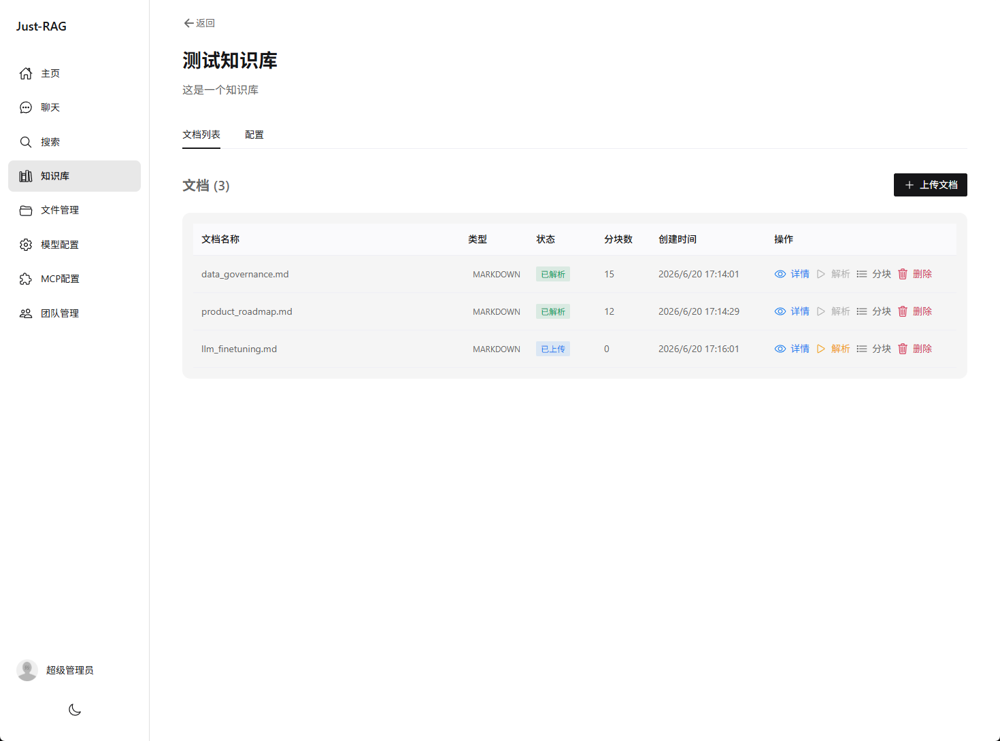
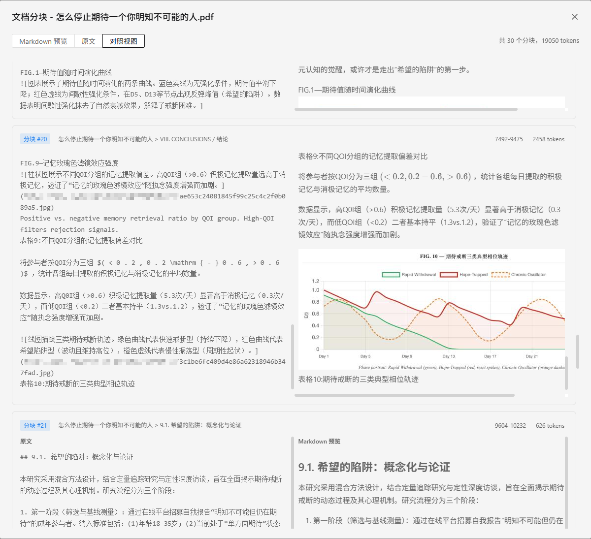
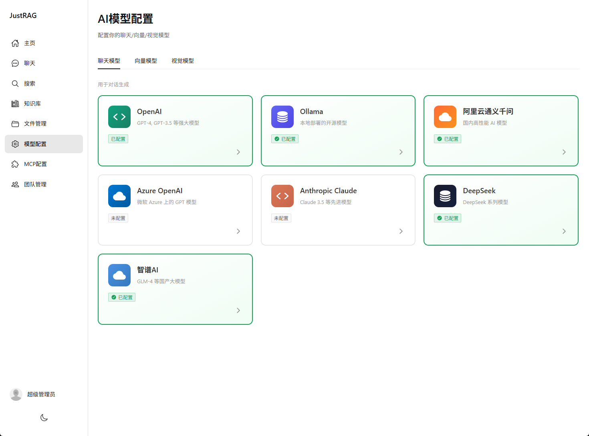
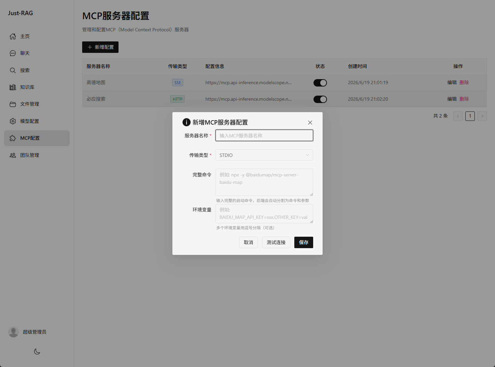
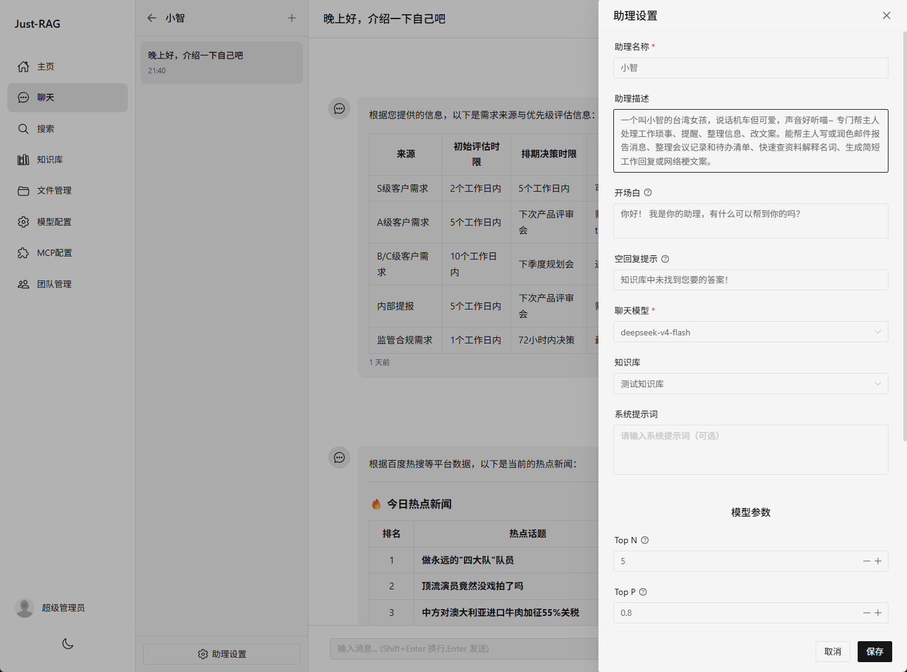
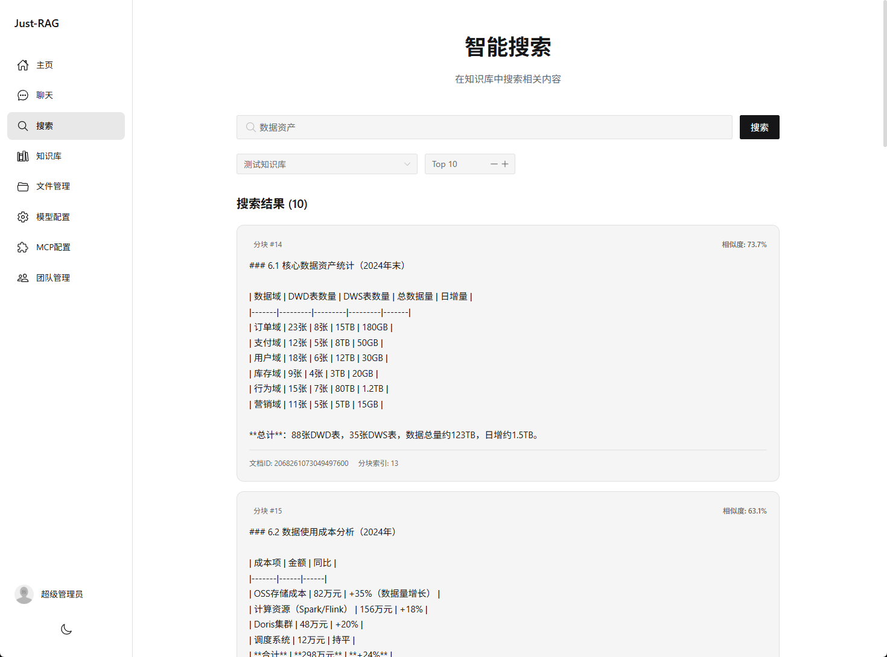

# JustRAG

    

[功能特性](#-功能特性) • [技术栈](#-技术栈) • [系统架构](#-系统架构) • [快速开始](#-快速开始) • [数据库设计](#-数据库设计)

---

JustRAG 是一个轻量级、简洁实用的 RAG 平台，结合了知识库管理与 AI 对话能力。支持多种文档格式解析、向量化存储、语义检索，并集成主流 AI 模型。

## 💪 核心能力

- **知识库管理**：创建、编辑、删除知识库，支持团队级别资源隔离
- **MinerU**：整合 MinerU 高精度文档解析引擎，支持复杂多模态文档处理
- **智能文档处理**：支持 PDF、Word、Excel、Markdown、HTML、TXT 等多种格式，支持多模态识别增强
- **结构感知切分**：SMART（章节 + 段落边界）/ FIXED（固定滑动窗口）双策略
- **向量存储**：支持 Milvus / PostgreSQL / Elasticsearch 多向量库切换
- **多模型对话**：支持 DashScope / OpenAI / DeepSeek / Ollama / ZhipuAI / Anthropic / Azure OpenAI
- **聊天助理**：可配置知识库绑定、系统提示词、模型参数（Top-P/Temperature等）、检索参数（TopN）
- **MCP 服务编排**：支持 STDIO / SSE / HTTP 传输的 MCP Server 配置管理
- **流式响应**：实时 SSE 流式对话 + Vue 3 Naive UI 前端
- **团队协作**：Sa-Token 认证 + 团队协作与权限管理

---

## 📸 效果预览















---

## ✨ 功能特性

### 知识库管理
- 创建、编辑、删除知识库
- 为知识库配置 AI 模型和切分策略
- 向量集合自动管理
- 团队级别的资源隔离

### 文档处理
- 智能文档解析与切分（SMART/FIXED 双策略），结合 MinerU 实现复杂多模态文档处理
- 多模态识别增强：结合视觉模型对文档中图片进行语义理解，替换原始图片引用为文字描述
- 支持多种文档格式：PDF、Word（.doc/.docx）、Excel（.xls/.xlsx）、Markdown、HTML、TXT
- 文档解析状态追踪（UPLOADED → PARSING → PARSED/FAILED）
- 文档向量化与存储（分批 Embedding，DashScope API 限制 ≤10 条/次）

**MinerU 文档解析演示：**

<video src="docs/mineru/pdf_zh_cn.mp4" controls width="100%"></video>

### 智能对话
- 创建多个 AI 助手
- 支持两种对话模式：
  - 自由对话：通用 AI 问答
  - 知识库对话：基于知识库内容的上下文对话（RAG）
- 实时流式响应（Server-Sent Events）
- 对话历史持久化（MySQL）
- RetrievalAugmentationAdvisor + VectorStoreDocumentRetriever

### 语义搜索
- 基于向量相似度的语义搜索
- 可配置 Top-K 结果数量
- 跨知识库搜索支持

### AI 模型集成
- 支持多个 AI 模型提供商：
  - OpenAI
  - Azure OpenAI
  - 阿里云百炼（DashScope）
  - 智谱 AI
  - Anthropic Claude
  - DeepSeek
  - Ollama（本地模型）
- 动态模型配置
- API Key 安全管理

### MCP 服务编排
- MCP Server 配置管理
- 支持 STDIO / SSE / HTTP 传输
- 动态工具注册与注销
- 工具调用结果展示

### 用户与团队
- 用户注册与登录（基于邮箱）
- Sa-Token 认证
- 多团队支持
- 团队资源隔离

---

## 🛠 技术栈

### 后端技术

| 技术 | 版本 | 说明 |
|------|------|------|
| Java | 21 | 编程语言 |
| Spring Boot | 3.5.5 | 应用框架 |
| MyBatis Plus | 3.5.9 | ORM 框架 |
| MySQL | 8.0+ | 关系型数据库 |
| Redis | 7.0 | 缓存与会话 |
| Milvus | 2.6.9 | 向量数据库 |
| Sa-Token | 1.40.0 | 权限认证 |
| Spring AI | 1.0.0 | AI 模型集成 |
| DashScope | 1.0.0.2 | 阿里云 AI 平台 |
| MCP Client | 0.17.0 | MCP 协议客户端 |
| Hutool | 5.8.26 | Java 工具库 |
| Apache POI | 5.2.5 | Office 文档处理 |
| PDFBox | 2.0.30 | PDF 处理 |
| JSoup | 1.16.1 | HTML 解析 |
| Druid | 1.2.20 | 数据库连接池 |

### 前端技术

| 技术 | 版本 | 说明 |
|------|------|------|
| Vue | 3.4+ | 前端框架 |
| TypeScript | 5.3+ | 编程语言 |
| Vite | 5.0+ | 构建工具 |
| Pinia | 2.1+ | 状态管理 |
| Vue Router | 4.2+ | 路由管理 |
| Naive UI | 2.38+ | UI 组件库 |
| Axios | 1.6.5 | HTTP 客户端 |
| marked | 17.0 | Markdown 渲染 |
| highlight.js | 11.11 | 代码高亮 |
| kaTeX | 0.16+ | LaTeX 数学公式渲染 |

---

## 🏗 系统架构

```
文档上传 (PDF/Word/Excel/MD/HTML/TXT)
    │
    ▼
DocumentParser (common/util/DocumentParser.java)
    ├─ PDFBox → PDF 文本提取
    ├─ Apache POI → Word/Excel 解析
    ├─ Jsoup → HTML → 纯文本
    └─ 原生 IO → MD/TXT 直接读取
    │
    ▼
MarkdownSplittingService (splitting/MarkdownSplittingService.java)
    ├─ SMART 策略：Markdown 标题层级 → 章节树 → 段落边界 → 句子边界 → 字符兜底
    │   （不设重叠窗口，天然语义断点）
    ├─ FIXED 策略：chunkSize 滑动窗口 + overlap 重叠
    └─ 视觉理解：AI 视觉模型分析文档图片 → 替换为文字描述
    │
    ▼
VectorStoreService (service/impl/VectorStoreServiceImpl.java)
    ├─ 可切换向量库（Milvus / PostgreSQL / Elasticsearch）
    ├─ 分批 Embedding（DashScope API 限制 ≤10 条/次，实际 batch=8）
    └─ 元数据：documentId / chunkId / chunkIndex / knowledgeBaseId
    │
    ▼
ChatServiceImpl (service/impl/ChatServiceImpl.java)  ← RAG 对话
    ├─ RetrievalAugmentationAdvisor + VectorStoreDocumentRetriever
    ├─ DatabaseChatMemory（MySQL 持久化）
    └─ Flux<String> SSE 流式响应
    │
    ├─ REST API (controller/)     ← Spring MVC + SSE
    └─ Vue 3 + Naive UI (platform-web/)
```

### 数据流程

1. **文档解析流程**：文本提取 → Markdown 切分 → 视觉理解（可选）→ 向量化 → 向量库存储
2. **对话流程**：用户提问 → 向量化 → 语义检索 → 构建上下文 → AI 生成回答 → SSE 流式返回
3. **搜索流程**：用户查询 → 向量化 → 相似度搜索 → 返回 Top-K 结果

---

## 🚀 快速开始

### 环境要求

- **JDK**: 21+
- **Node.js**: 18+
- **Maven**: 3.6+
- **MySQL**: 8.0+
- **Redis**: 6.0+
- **向量库**: milvus / postgresql / elasticsearch

### 1. 克隆项目

```bash
git clone <repository-url>
cd just-rag
```

### 2. 数据库初始化

创建 MySQL 数据库：

```sql
CREATE DATABASE just-rag CHARACTER SET utf8mb4 COLLATE utf8mb4_unicode_ci;
```

运行 SQL 脚本：

```bash
mysql -u root -p just-rag < docs/sql/just-rag.sql
```

### 3. 配置后端

编辑 `src/main/resources/application.yml`：

```yaml
# 向量库配置
vector-store:
  # 切换向量库时只需修改此值，系统会自动使用对应类型的配置
  # 向量存储类型 可选(milvus/postgresql/elasticsearch)
  type: milvus
  # Embedding API 单次批量大小，可根据提供商调整此值
  embedding-batch-size: 8

# MinerU配置
mineru:
  server-url: https://mineru.net
  # MinerU 云端 API Token，用于访问 https://mineru.net API
  # 如果使用本地化部署，此配置项可留空
  token: xxx
```

编辑 `src/main/resources/application-dev.yml`：

```yaml
spring:
  # 数据源配置
  datasource:
    url: jdbc:mysql://localhost:3306/just-rag
    username: your_username
    password: your_password
  # Redis配置
  data:
    redis:
      host: localhost
      port: 6379
```

### 4. 启动后端

```bash
mvn clean install
mvn spring-boot:run
```

后端服务运行在 `http://localhost:8080`

### 5. 启动前端

```bash
cd platform-web
npm install
npm run dev
```

前端服务运行在 `http://localhost:3000`

### 6. 访问应用

打开浏览器访问：http://localhost:3000 (admin / admin123)

---

## 📊 数据库设计

| 表名                     | 说明      |
|------------------------|---------|
| `ai_mcp_server_config` | MCP 服务配置 |
| `ai_model_config`      | AI 大模型配置 |
| `chat_assistant`       | 聊天助理配置  |
| `chat_message`         | 聊天消息    |
| `chat_session`         | 聊天会话    |
| `document`             | 知识库文档   |
| `document_chunk`       | 文档内容分块  |
| `file_detail`          | 文件记录    |
| `knowledge_base`       | 知识库     |
| `oss_config`           | 存储配置表    |
| `sys_user`             | 用户信息    |
| `sys_user_team`        | 团队关联    |

---

## 📄 开源协议

本项目采用 [MIT License](LICENSE) 开源协议，自由使用，欢迎贡献！

---

**[⬆ 回到顶部](#JustRAG)**
